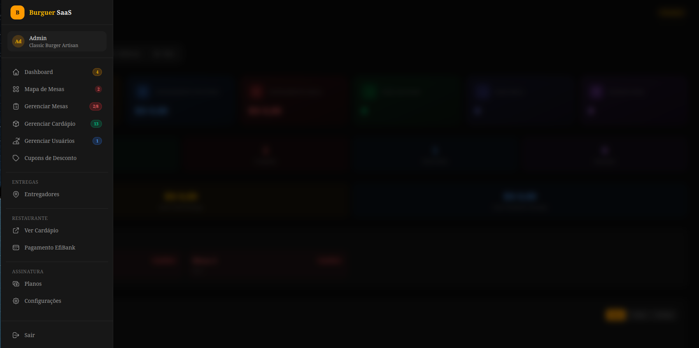

<p align="center">
  
</p>

# SaaS Mesa

Sistema multi-tenant de gestão de mesas e pedidos para restaurantes, com cardápio digital, painel de garçom, painel/API de entregador, fidelidade/cupons e **3 camadas de pagamento via EfiBank**.

> ⚠️ **Status**: o backend (API, regras de negócio, multi-tenancy, pagamentos, delivery) está maduro. O **painel do dono da plataforma (superadmin)** existe como **painel web completo** (`/superadmin/*`, Livewire/Blade) com o mesmo conjunto de funcionalidades exposto também por API JSON (`/api/superadmin/*`).

---

## Sumário

- [Visão geral](#visão-geral)
- [Stack](#stack)
- [Arquitetura multi-tenant](#arquitetura-multi-tenant)
- [Papéis de usuário](#papéis-de-usuário)
- [Planos da plataforma](#planos-da-plataforma)
- [Módulos e funcionalidades](#módulos-e-funcionalidades)
- [3 camadas de pagamento](#3-camadas-de-pagamento)
- [Segurança](#segurança)
- [Instalação](#instalação)
- [Ambiente de desenvolvimento](#ambiente-de-desenvolvimento)
- [Variáveis de ambiente](#variáveis-de-ambiente)
- [Rotas — Web](#rotas--web)
- [Rotas — API](#rotas--api)
- [Comandos Artisan](#comandos-artisan)
- [Testes](#testes)
- [Deploy](#deploy)
- [Estrutura de diretórios](#estrutura-de-diretórios)
- [Pendências / Roadmap](#pendências--roadmap)

---

## Visão geral

O SaaS Mesa permite que restaurantes assinem a plataforma e, cada um em seu próprio subdomínio, operem:

- Cardápio digital público, com carrinho e pedido pelo cliente
- Painel administrativo do restaurante (mesas, cardápio, usuários, cupons, fidelidade, entregadores, financeiro, backup, suporte)
- Painel do garçom para atender mesas presencialmente (plano Premium)
- Área do cliente final para acompanhar pedidos e pontos de fidelidade
- Painel web (`/entregador`) e API mobile (`/api/delivery`) de entregadores, com convite por token
- Rastreio público de pedido, sem necessidade de login
- Cobrança do cliente final via Pix/Boleto (EfiBank), e cobrança do próprio restaurante pela assinatura da plataforma

Quem administra a plataforma como um todo (o dono do SaaS) gerencia planos, assinaturas dos tenants, financeiro consolidado, backups, webhooks e auditoria — **pelo painel web `/superadmin/*` ou pela API `/api/superadmin/*`**.

## Stack

| Camada | Tecnologia |
|---|---|
| Backend | Laravel 13 (PHP 8.3+) |
| Frontend | Livewire 4, Alpine.js 3, Tailwind CSS 4 (Vite) |
| Banco de dados | MySQL 8+ (SQLite em testes) |
| Cache / Fila / Sessão | Redis |
| Autenticação de API | Laravel Sanctum (guard `delivery`) |
| Pagamentos | EfiBank (ex-Gerencianet) — Pix, Boleto |
| QR Code | endroid/qr-code |
| Markdown (termos de uso) | league/commonmark |
| Testes | Pest 4 |

## Arquitetura multi-tenant

Isolamento completo via `TenantScope` (global scope) + trait `BelongsToTenant`:

```
Subdomínio:  empresa1.saasmesa.com.br → Tenant::where('slug', 'empresa1')
Middleware:  ResolveTenant → CheckTenantSubscription / CheckSubscription → Auth
Scope:       BelongsToTenant trait → WHERE tenant_id = ? em TODAS as queries do tenant
```

Cada `Tenant` tem: `plan` (`free` | `paid`), `max_tables`, `status`, período de trial, além de configurações próprias (horário de funcionamento, WhatsApp, logo, SMTP, cupons habilitados, custo de entrega, endereço/raio de entrega). O `TenantObserver` reage a mudanças de plano: quando um tenant deixa de ser `paid`, desativa automaticamente o módulo de fidelidade (`PointsService::disableForTenant`) e invalida o cache de resolução de domínio/subdomínio (`TenantResolverService`).

Modelos isolados por escopo global: `Category`, `Product`, `Order`, `Table`, `Coupon`, `Payment`, `DeliveryPerson`, `Ingredient`, `Notification`, `UserAddress`, `DeliveryEarning`, `ProductAttribute`, `SupportTicket`, `OrderPayment`, `TenantEfiCredentials`, `TenantBillingConfig`, `CustomerPoint`, `PointsTransaction`, `StockMovement`, `LoyaltyConfig`. Exceções deliberadas (sem escopo): `WebhookLog` e `TenantInvoice` (criados fora de autenticação por webhooks/jobs e lidos apenas por superadmin).

## Papéis de usuário

| Papel | Onde atua | Acesso |
|---|---|---|
| **superadmin** | Dono da plataforma | Painel web `/superadmin/*` **e** API `/api/superadmin/*` — gestão de planos, tenants, usuários, financeiro consolidado, backups, webhooks, auditoria, LGPD |
| **admin** | Dono/gerente do restaurante (tenant) | `/dashboard/*` — painel completo do estabelecimento |
| **atendente / garçom** | Staff do restaurante | `/painel/{slug}` — atendimento de mesas (requer plano Premium) |
| **entregador** | Delivery | `/entregador/*` (painel web, guard `delivery-web`) e `/api/delivery/*` (app mobile, guard `delivery` via Sanctum) |
| **cliente** | Cliente final do restaurante | `/cardapio/{slug}` (público) e `/conta/{slug}` (logado) |

## Planos da plataforma

O sistema tem **apenas 2 planos** definidos hoje (constantes em `App\Models\Tenant` e seed em `SaasPlanSeeder`):

| Plano | Preço | Mesas | Produtos | Usuários | Boleto | Relatórios | Delivery | Suporte prioritário |
|---|---|---|---|---|---|---|---|---|
| **Gratuito** (`free`) | R$ 0 | 2 | 20 | 2 | Não | Não | Não | Não |
| **Premium** (`paid`) | R$ 97,90/mês | 50 | 999 | 20 | Sim | Sim | Sim | Sim |

> Não há um plano "Enterprise" no código atual — se isso vier a existir, precisa ser criado em `SaasPlanSeeder` e nas constantes `Tenant::PLAN_*`.

## Módulos e funcionalidades

### Painel do restaurante (`/dashboard`, role `admin`)
- **Dashboard** — visão geral do estabelecimento
- **Mesas** (`TablesPage` / `TableGrid`) — grade de mesas, status, comandas
- **Cardápio** (`MenuManager`) — categorias, produtos, atributos/variações, estoque (`Ingredient`, `StockMovement`)
- **Usuários** (`UserManager`) — equipe do restaurante
- **Cupons** (`CouponManager`) — cupons de desconto
- **Fidelidade** (`LoyaltyManager`) — pontos por compra, resgates (`CustomerPoint`, `PointsTransaction`, `LoyaltyConfig`)
- **Entregadores** (`DeliveryPeopleManager`) — cadastro de entregadores
- **Financeiro do tenant** (`Tenant\FinancialController`) — extrato de pagamentos recebidos, resumo
- **Credenciais EfiBank** (`EfiCredentialsManager`) — chaves Pix/certificado do próprio restaurante, criptografadas
- **Configuração de e-mail SMTP** (`SmtpSettings`) — envio de e-mails com servidor próprio do tenant
- **Configurações gerais** (`Settings`) — dados da empresa, horários, logo
- **Backup** (`BackupManager` + `TenantBackupService` + model `TenantBackup`) — backup/exportação dos dados da empresa em JSON, retenção por plano (7 dias no gratuito, ilimitada no pago), download autenticado e purge diário (`backups:purge`)
- **Suporte** (`SupportManager`) — tickets de suporte (`SupportTicket`, `SupportTicketMessage`)
- **Assinatura da plataforma** (`SubscriptionCheckout` + `SubscriptionController`) — contratar/cancelar plano do SaaS
- **Contadores da sidebar** (`SidebarCounts`) — atualizados por polling (`wire:poll` do Livewire, não websocket)

### Cardápio público e pedidos (`/cardapio/{slug}`)
- Cardápio público (`Livewire\Public\Menu`) e carrinho (`Livewire\Public\Cart`, trait `HasCart`)
- Login/cadastro/recuperação de senha de garçom e cliente por tenant
- Rastreio público de pedido, sem autenticação: `/pedido/{id}/rastreio` (web) e `/api/pedido/{id}/status` (API)

### Painel do garçom (`/painel/{slug}`, requer plano Premium)
- `WaiterDashboard` — atendimento de mesas e pedidos, com contadores via polling (`WaiterSidebarCounts`)
- `WaiterSupport` — suporte

### Área do cliente final (`/conta/{slug}`)
- `ClientDashboard` — histórico de pedidos, pontos de fidelidade, contadores via polling (`ClientSidebarCounts`)
- `SupportPage` — suporte
- Favoritos de produto (model `UserFavorite`, relação `User` ↔ `Product`)

### Painel e API de entregadores
- **Painel web** (`/entregador/*`, guard `delivery-web`, sessão): login, recuperação de senha, dashboard (`Livewire\Delivery\DeliverySidebarCounts` para contadores), aceitar/coletar/entregar pedido, alternar disponibilidade, configurações, notificações, exportação de dados e exclusão de conta (LGPD) e logout — controller `Web\DeliveryWebController`
- **Convite de entregador por token**: `Web\DeliveryInviteController` (fluxo web) e `Api\DeliveryInvitationController` (fluxo mobile), permitindo que o entregador crie a própria conta a partir de um link enviado pelo restaurante
- **API mobile** (`/api/delivery/*`, guard `delivery` via Sanctum, com compatibilidade explícita com token legado — `api_token` em texto plano é aceito durante a transição com log de deprecação, novos tokens são gravados como hash SHA-256): login, aceitar/recusar/coletar pedido, atualizar status, listar pedidos disponíveis e "meus pedidos", perfil — controller `Api\DeliveryController`
- **Regras de negócio de entrega** centralizadas em `App\Services\DeliveryService` (inclui custo de entrega por distância: valor fixo + por km, com endereço/raio configuráveis por tenant)
- **Ganhos do entregador** (`DeliveryEarning`) — ganho pendente por entrega, marcação de pago pelo admin, resumo e histórico diário
- **Notificações de entregador** (`DeliveryNotificationService` + model `Notification`, relação polimórfica): notifica entregadores ativos quando surge um novo pedido de entrega disponível, e notifica o tenant quando o pedido é aceito/coletado/entregue. As notificações são consultadas via polling (`GET /entregador/notificacoes`), não por push/websocket.
- **Regras de autorização** descritas em `App\Policies\DeliveryPersonPolicy` (quem pode ver/aceitar/recusar/atualizar um pedido de entrega, todas amarradas ao `tenant_id`)

### Painel do superadmin (dono do SaaS) — painel web **e** API

O painel web (`/superadmin/*`, autenticado via `role:superadmin`) é servido pelo `SuperadminPanelController` + `SuperadminAuthController`, com telas Livewire/Blade em `resources/views/superadmin/*`:

| Página web | Rota | API equivalente |
|---|---|---|
| Dashboard (visão geral) | `/superadmin` | `GET /api/superadmin/financial/overview` |
| Relatórios (relatório completo do sistema) | `/superadmin/relatorios` | `GET /api/superadmin/system/report`, `GET /api/superadmin/financial/overview` |
| Empresas (tenants): listar, criar, suspender, reativar, trocar plano, forçar cobrança, exportar dados, excluir | `/superadmin/empresas` | `GET/POST/DELETE /api/superadmin/tenants`, `/tenants/{id}/suspend`, `/reactivate`, `/plan`, `/force-charge`, `/export` |
| Configurações de uma empresa | `/superadmin/empresas/{tenant}/configuracoes` | `GET/PUT /api/superadmin/tenants/{tenant}/settings` |
| Planos | `/superadmin/planos` | CRUD `/api/superadmin/plans` |
| Financeiro consolidado | `/superadmin/financeiro` | `GET /api/superadmin/financial/*` |
| Fidelidade por tenant | `/superadmin/loyalty` | `GET /api/superadmin/loyalty`, `POST /loyalty/{tenant}/toggle` |
| Backups de todos os tenants | `/superadmin/backups` | `GET/POST /api/superadmin/backups`, `DELETE /backups/{backup}` |
| Usuários da plataforma | `/superadmin/usuarios` | `GET/POST /api/superadmin/users`, `POST /users/{user}/revoke` |
| Logs de webhooks | `/superadmin/webhooks` | `GET /api/superadmin/webhook-logs`, `/webhook-logs/{log}` |
| Auditoria (log de ações do superadmin) | `/superadmin/auditoria` | `GET /api/superadmin/audit-logs` |
| Privacidade (LGPD) | `/superadmin/privacidade` | — |

A auditoria (`AuditService` + model `AuditLog`) registra **quem** (admin), **o quê** (ação), **em qual tenant**, **IP** e dados da ação para: criar/suspender/reativar/trocar plano/forçar cobrança/excluir/exportar tenant, criar/editar planos, toggle de fidelidade, criar/excluir backups, criar/revogar superadmins e editar configurações de empresa.

## 3 camadas de pagamento

### Camada 1 — Assinatura do dono do SaaS

| Entidade | Descrição |
|---|---|
| `SaasPlan` | Planos da plataforma (Gratuito, Premium) |
| `SaasSubscription` | Assinatura por tenant (`trial` → `active` → `past_due` → `suspended` → `cancelled`) |
| `SaasPaymentHistory` | Histórico de pagamentos da assinatura |

**Fluxo**: tenant se registra → `SaasSubscription` em trial → admin escolhe plano → `active` → vencimento sem pagamento → `past_due` → após `EFI_SUSPENSION_AFTER_DAYS` (padrão 5) → `suspended` (job automático) → webhook confirma pagamento → `active` novamente e tenant reativado.

### Camada 2 — Pagamentos internos (cliente paga a comanda)

| Entidade | Descrição |
|---|---|
| `TenantEfiCredentials` | Credenciais EfiBank do tenant, criptografadas (AES-256-GCM) |
| `OrderPayment` | Pagamento do pedido (Pix/Boleto), com chave de idempotência |
| `Order.payment_status` | `pending` \| `paid` |

**Fluxo**: cliente solicita pagamento → `OrderPayment` criado → `EfiBankClient::forTenant()` gera cobrança Pix com as credenciais do tenant → webhook EfiBank → job `ProcessEfiBankWebhook` marca como `paid` → evento `App\Events\OrderPaid` é disparado. O evento implementa `ShouldBroadcast` no canal `tenant.{tenant_id}.orders` (evento `order.paid`) — **por padrão o `.env.example` traz `BROADCAST_CONNECTION=log`**, então esse broadcast só chega ao navegador se um driver real (Reverb/Pusher/Ably) for configurado em produção. O listener `NotifyOrderPaid` reage a esse evento concedendo os pontos de fidelidade do pedido via `PointsService::grantPointsForOrder`.

### Camada 3 — Billing interno da empresa

| Entidade | Descrição |
|---|---|
| `TenantBillingConfig` | Configuração de faturamento (fixo ou por transação) |
| `TenantInvoice` | Faturas geradas para o restaurante |

> A camada EfiBank é unificada em `App\Services\EfiBank\` (`EfiBankClient`, `SaasEfiBankService`, `TenantEfiBankService`, `TenantEfiCredentialsService`, `WebhookValidatorService`), configurada por `config/efibank.php` e credenciais SaaS no `.env` (`EFI_*`).

## Segurança

| # | Ponto | Mitigação |
|---|---|---|
| 1 | Vazamento cross-tenant | `BelongsToTenant` trait + `TenantScope` global em todas as queries |
| 2 | Credenciais em texto plano | AES-256-GCM (`EncryptedCredentialService`), com suporte a rotação de chave (`RotateKeyTest`) |
| 3 | Webhook sem validação | HMAC obrigatório (`ValidateWebhookSignature`) + fila + idempotência; CSRF é explicitamente desabilitado só para `webhook/efi/*` |
| 4 | Força bruta no login | `throttle` (5 ou 10 requisições/minuto conforme a rota) nas rotas de auth web, entregador e API |
| 4b | Força bruta no superadmin | `throttle:superadmin` (120/min) em toda rota `/superadmin/*` (web e API) e `throttle:superadmin-sensitive` (20/min) nas ações destrutivas (suspender, reativar, trocar plano, force-charge, backups, loyalty, settings) |
| 5 | Timeout EfiBank | Operações sensíveis via Job na fila |
| 6 | Cobrança duplicada | `idempotency_key` único na criação de pagamentos |
| 7 | Tenant suspenso acessando o sistema | `CheckTenantSubscription` / `CheckSubscription` bloqueiam o acesso |
| 8 | Acesso indevido entre papéis | Middlewares dedicados: `CheckAdminRole`, `CheckRole`, `CheckStaffRole` |
| 9 | Headers HTTP | `SecurityHeaders` aplica em toda rota web e API: `X-Frame-Options: DENY`, `X-Content-Type-Options: nosniff`, `Referrer-Policy: strict-origin-when-cross-origin`, `Content-Security-Policy` (própria política, ver abaixo) e `Permissions-Policy: camera=(), microphone=(), geolocation=()`. `Strict-Transport-Security` só é enviado quando `APP_ENV=production` |
| 10 | Garçom/cliente/entregador acessando dados de outro tenant | Verificação explícita `tenant_id` nas rotas de painel/conta, além do scope global |
| 11 | Ações do superadmin sem rastro | `AuditService` + model `AuditLog`: toda ação de suspender/reativar/trocar plano/forçar cobrança/criar tenant/planos/backups/superadmins é registrada com admin, tenant, IP e payload |

```
Content-Security-Policy: default-src 'self'; script-src 'self' 'unsafe-inline' 'unsafe-eval' https://*.saasmesa.com.br; style-src 'self' 'unsafe-inline'; img-src 'self' data: blob: https:; font-src 'self' data:; connect-src 'self' https://*.efipay.com.br https://*.saasmesa.com.br; frame-src 'self'; object-src 'none'; base-uri 'self'; form-action 'self'
X-Frame-Options: DENY
X-Content-Type-Options: nosniff
Referrer-Policy: strict-origin-when-cross-origin
Permissions-Policy: camera=(), microphone=(), geolocation=()
```

> Nota: em `APP_ENV=production` o CSP remove `'unsafe-eval'` (mantido apenas fora de produção para o HMR do Vite).

## Instalação

### Pré-requisitos

- PHP 8.3+ com extensões: BCMath, Ctype, JSON, Mbstring, OpenSSL, PDO (MySQL), Redis, XML, GD, Sodium
- Composer 2.x
- MySQL 8+ (ou PostgreSQL 15+)
- Redis 6+
- Node.js 20+ e npm
- Supervisor (para o queue worker em produção)
- Certificado EfiBank (.p12) para processar pagamentos

### Passo a passo

```bash
# 1. Clonar o repositório
git clone https://github.com/gregorioponciano/saas-mesa.git
cd saas-mesa

# 2. Configurar variáveis de ambiente
cp .env.example .env
nano .env   # preencha DB_*, EFI_*, TENANT_*, etc.

# 3. Instalar dependências PHP
composer install --no-interaction

# 4. Gerar a APP_KEY
php artisan key:generate

# 5. Gerar a chave de criptografia das credenciais dos tenants
# (usada pelo EncryptedCredentialService — AES-256-GCM)
php artisan tenant:generate-encryption-key
# Colar o resultado em TENANT_CREDENTIAL_ENCRYPTION_KEY no .env

# 6. Criar o banco de dados
mysql -u root -p -e "CREATE DATABASE saas_mesa CHARACTER SET utf8mb4 COLLATE utf8mb4_unicode_ci;"

# 7. Rodar as migrations (47 arquivos)
php artisan migrate --force

# 8. (Opcional) Popular com dados de teste
php artisan db:seed --force

# 9. Instalar dependências Node e buildar assets
npm install
npm run build

# 10. Criar link simbólico do storage
php artisan storage:link

# 11. Configurar Supervisor (queue worker) — ver seção Deploy

# 12. Configurar o crontab para o agendador
# * * * * * cd /caminho/para/saas-mesa && php artisan schedule:run >> /dev/null 2>&1

# 13. Criar o superadmin (dono da plataforma)
php artisan saas:create-superadmin

# 14. Rodar os testes
php artisan test
```

O `composer.json` também define um script `composer setup` (install → copiar `.env` → `key:generate` → `migrate --force` → `npm install --ignore-scripts` → `npm run build`), útil para provisionar rápido.

## Ambiente de desenvolvimento

```bash
composer run dev
# Roda em paralelo (via concurrently):
#   - php artisan serve
#   - php artisan queue:listen --tries=1 --timeout=0
#   - php artisan pail --timeout=0
#   - npm run dev
```

### Comandos úteis

```bash
php artisan key:generate --show     # exibir a APP_KEY atual
php artisan config:clear            # limpar cache de configuração
php artisan route:clear             # limpar cache de rotas
php artisan route:list              # listar todas as rotas
php artisan migrate:rollback        # reverter última migration
php artisan migrate:status          # status das migrations
```

## Variáveis de ambiente

O `.env.example` do projeto é extenso (sessão, broadcasting, fila, cache, e-mail etc., com a maioria comentada/opcional). Os blocos específicos do domínio do SaaS Mesa que precisam ser preenchidos são:

```env
# App
APP_NAME="SaaS Mesa"
APP_URL=https://app.saasmesa.com.br
APP_LOCALE=pt_BR

# EfiBank — credenciais do SaaS (camada 1)
# Webhook a cadastrar no EfiBank: https://app.saasmesa.com.br/webhook/efi/saas
EFI_CLIENT_ID=
EFI_CLIENT_SECRET=
EFI_PIX_KEY=
EFI_SANDBOX=false
EFI_CERTIFICATE_PATH=/var/www/certs/efi-producao.p12
EFI_CERT_PASSWORD=
EFI_WEBHOOK_SECRET=
EFI_SUSPENSION_AFTER_DAYS=5

# Criptografia das credenciais EfiBank de cada tenant (camada 2)
TENANT_CREDENTIAL_ENCRYPTION_KEY=

# Multi-tenancy
SAAS_MAIN_DOMAIN=saasmesa.com.br
TENANT_SUBDOMAIN_PATTERN=*.saasmesa.com.br

# Admin (recebe alertas críticos do sistema)
ADMIN_EMAIL=gregorio@saasmesa.com.br

# Redis (padrão para fila, cache e sessão)
REDIS_HOST=127.0.0.1
QUEUE_CONNECTION=redis
CACHE_STORE=redis
SESSION_DRIVER=redis
```

> Cada tenant também pode configurar **suas próprias** credenciais EfiBank (camada 2) e servidor SMTP pelo próprio painel — não vão no `.env`.

## Rotas — Web

### Institucionais e autenticação
```
GET  /                              → Landing page
GET  /termos-de-uso                 → Termos (renderizado a partir de docs/termos-de-uso-saas-mesa.md)
GET  /politica-de-privacidade       → Política de privacidade
GET  /login | POST /login           → Login do admin do tenant   (throttle:10,1)
GET  /register | POST /register     → Cadastro de nova empresa   (throttle:10,1)
POST /logout
GET|POST /login/recuperar-senha, /login/redefinir-senha/{token}   (throttle:5,1)
```

### Painel do superadmin (`/superadmin`, role `superadmin`)
```
GET  /superadmin/login | POST /superadmin/login      → Login do superadmin (throttle:10,1)
POST /superadmin/logout
GET  /superadmin                        → Dashboard com relatório do sistema
GET  /superadmin/empresas               → Gestão de empresas (tenants)
GET  /superadmin/empresas/{tenant}/configuracoes
GET  /superadmin/planos                 → Planos da plataforma
GET  /superadmin/financeiro             → Financeiro consolidado
GET  /superadmin/loyalty                → Fidelidade por tenant
GET  /superadmin/backups                → Backups de todos os tenants
GET  /superadmin/usuarios               → Usuários da plataforma
GET  /superadmin/webhooks               → Logs de webhooks
GET  /superadmin/auditoria              → Log de auditoria de ações
GET  /superadmin/privacidade            → LGPD
```

### Painel do restaurante (`admin`, prefixo `/dashboard`)
Protegido por `auth`, `tenant.scope`, `block.superadmin.from.tenant.panel`, `check.subscription`, `check.admin`.
```
GET  /dashboard                     → Dashboard
GET  /dashboard/tables              → Mesas
GET  /dashboard/menu                → Cardápio
GET  /dashboard/users               → Usuários da equipe
GET  /dashboard/cupons              → Cupons
GET  /dashboard/entregadores        → Entregadores
GET  /dashboard/pontos              → Fidelidade
GET  /dashboard/configuracoes       → Configurações da empresa
GET  /dashboard/efi-credentials     → Credenciais EfiBank do tenant
GET  /dashboard/configurar-email    → SMTP do tenant
GET  /dashboard/suporte             → Suporte
GET  /dashboard/backup              → Backup/exportação de dados
GET  /dashboard/backup/{backup}/download   → Download do backup (throttle:10,1)
GET|POST /subscription              → Checkout da assinatura da plataforma
POST /subscription/cancel           → Cancelar assinatura
```

### Cardápio, rastreio e acesso de garçom/cliente
```
GET  /pedido/{id}/rastreio                     → Rastreio público do pedido (sem login)
GET  /cardapio/{slug}                          → Cardápio público
GET|POST /cardapio/{slug}/acesso               → Login do garçom          (throttle:10,1)
GET|POST /cardapio/{slug}/cadastro             → Auto-registro de garçom  (throttle:10,1)
GET|POST /cardapio/{slug}/recuperar-senha      → Recuperação de senha     (throttle:5,1)
GET|POST /cardapio/{slug}/redefinir-senha/{t}  → Redefinição de senha     (throttle:5,1)
```

### Painel do garçom (`/painel/{slug}`, requer plano Premium)
```
GET  /painel/{slug}                 → Atendimento de mesas
GET  /painel/{slug}/configuracoes   → Configurações
GET  /painel/{slug}/suporte         → Suporte
```

### Área do cliente final (`/conta/{slug}`)
```
GET  /conta/{slug}                  → Painel do cliente (pedidos, pontos)
GET  /conta/{slug}/suporte          → Suporte
```

### Painel web do entregador (`/entregador`, guard `delivery-web`)
```
GET|POST /entregador/login                       → Login                    (throttle:10,1)
GET|POST /entregador/recuperar-senha             → Recuperação de senha     (throttle:5,1)
GET|POST /entregador/redefinir-senha/{token}     → Redefinição de senha     (throttle:5,1)
GET  /entregador/painel                          → Dashboard
GET  /entregador/notificacoes                    → Notificações (JSON, consultado por polling)
POST /entregador/notificacoes/{notification}/ler → Marcar notificação como lida
POST /entregador/pedidos/{order}/aceitar         → Aceitar pedido
POST /entregador/pedidos/{order}/coletar         → Marcar como coletado
POST /entregador/pedidos/{order}/entregar        → Marcar como entregue
POST /entregador/toggle-disponibilidade          → Alternar disponibilidade
POST /entregador/configuracoes                   → Atualizar configurações
GET  /entregador/exportar-dados                  → Exportar dados (LGPD)
POST /entregador/excluir-conta                   → Excluir conta (LGPD)
POST /entregador/logout                          → Logout
```

### Convite de entregador (público, por token)
```
GET  /convidar/entregador/sucesso     → Página de sucesso
GET  /convidar/entregador/{token}     → Formulário de aceite do convite      (throttle:10,1)
POST /convidar/entregador/{token}     → Aceitar convite e criar conta        (throttle:10,1)
```

### Webhooks (sem CSRF, com HMAC)
```
POST /webhook/efi/saas              → Webhook camada 1 (assinatura da plataforma)
POST /webhook/efi/tenant/{tenantId} → Webhook camada 2 (pagamento de pedidos)
```

## Rotas — API

### Autenticação
```
POST /api/auth/login      (throttle:5,1)
POST /api/auth/refresh    (throttle:5,1)
POST /api/auth/logout
```

### Rastreio público de pedido
```
GET /api/pedido/{id}/status         → Status do pedido (sem autenticação)
```

### Delivery (mobile — guard `delivery`, Sanctum + compatibilidade com token legado)
```
GET  /api/delivery/invitation/{token}       → Ver convite               (throttle:10,1)
POST /api/delivery/invitation/{token}       → Aceitar convite            (throttle:10,1)
GET  /api/delivery/login                    → Redireciona para o painel web se acessado via navegador (throttle:10,1)
POST /api/delivery/login                    → Login                     (throttle:10,1)
POST /api/delivery/logout                                                (throttle:60,1)
GET  /api/delivery/orders                   → Pedidos disponíveis        (throttle:60,1)
GET  /api/delivery/my-orders                → Meus pedidos               (throttle:60,1)
POST /api/delivery/orders/{order}/accept                                 (throttle:60,1)
POST /api/delivery/orders/{order}/refuse                                 (throttle:60,1)
POST /api/delivery/orders/{order}/pickup                                 (throttle:60,1)
POST /api/delivery/orders/{order}/status                                 (throttle:60,1)
GET  /api/delivery/profile                                                (throttle:60,1)
```

### Superadmin (`role:superadmin`) — painel web e API
```
GET|POST|PUT|DELETE /api/superadmin/plans[/{id}]          → CRUD de planos
GET|POST|DELETE    /api/superadmin/tenants[/{id}]         → Listar, criar, excluir tenants
GET  /api/superadmin/tenants/{id}                         → Detalhes do tenant
POST /api/superadmin/tenants/{id}/suspend                 → Suspender (registra auditoria)
POST /api/superadmin/tenants/{id}/reactivate              → Reativar (registra auditoria)
PUT  /api/superadmin/tenants/{id}/plan                    → Trocar plano (registra auditoria)
POST /api/superadmin/tenants/{id}/force-charge            → Forçar cobrança (registra auditoria)
GET  /api/superadmin/tenants/{id}/export                  → Exportar dados do tenant (LGPD)
GET|PUT /api/superadmin/tenants/{id}/settings             → Configurações do tenant
GET  /api/superadmin/users                                → Usuários da plataforma
POST /api/superadmin/users                                → Criar superadmin
POST /api/superadmin/users/{user}/revoke                  → Revogar acesso de superadmin
GET  /api/superadmin/financial/overview                   → Tenants ativos/suspensos/trial, MRR, receita 12 meses etc.
GET  /api/superadmin/financial/payments                   → Extrato geral (filtros: status, tenant_id, date_from, date_to, method)
GET  /api/superadmin/financial/subscriptions              → Assinaturas
GET  /api/superadmin/financial/invoices                   → Faturas (billing camada 3)
GET  /api/superadmin/financial/tenant/{tenant}            → Extrato de um tenant específico
GET  /api/superadmin/system/report                        → Relatório completo do sistema
GET  /api/superadmin/loyalty                              → Status do módulo de fidelidade por tenant
POST /api/superadmin/loyalty/{tenant}/toggle              → Habilitar/desabilitar fidelidade
GET|POST /api/superadmin/backups[/{backup}] (DELETE)      → Backups de todos os tenants
GET  /api/superadmin/webhook-logs[/{log}]                 → Logs de webhooks recebidos
GET  /api/superadmin/audit-logs                           → Log de auditoria (filtros por admin/tenant/ação/data)
```

### Tenant (autenticado, escopo do tenant, `throttle:60,1`)
```
POST /api/orders/{order}/pay                → Iniciar pagamento (Pix/Boleto)
GET  /api/orders/{order}/payment/status
GET  /api/orders/{order}/payment/qrcode
GET|PUT /api/settings/efi-credentials        → Credenciais EfiBank do tenant (admin)
POST /api/settings/efi-credentials/test      → Testar conexão (admin)
GET  /api/financial/payments                 → Histórico de pagamentos (admin)
GET  /api/financial/summary                  → Resumo financeiro (admin)
```

## Comandos Artisan

```bash
php artisan saas:create-superadmin                 # Criar o superadmin (dono da plataforma)
php artisan saas:check-subscriptions                # Verificar/suspender assinaturas vencidas (agendado: hourly)
php artisan saas:financial-report --month=YYYY-MM   # Relatório financeiro (agendado: dia 1 às 06:00)
php artisan backups:purge                           # Remover backups expirados (agendado: diário às 03:00)
php artisan tenant:generate-encryption-key           # Gerar a TENANT_CREDENTIAL_ENCRYPTION_KEY (AES-256)
```

## Testes

```bash
php artisan test
```

| Categoria | Cobre |
|---|---|
| `TenantIsolationTest` | Isolamento cross-tenant em categorias, pedidos, mesas, produtos, cupons + scope global |
| `TenantPolicyTest` | Policies de produto/categoria/cupom/mesa/usuário amarradas ao `tenant_id` |
| `TenantHeaderIsolationTest` | Impossibilidade de trocar tenant via header `X-Tenant-Id` |
| `TenantWebhookIsolationTest` | Webhook de um tenant não afeta outro |
| `TenantBackupTest` | Criação de backup, listagem, download autenticado, negação cross-tenant, purge e retenção por plano |
| `SubscriptionTest` | Ciclo de vida da assinatura, suspensão, reativação, acesso 402 quando suspenso |
| `PaymentTest` | Idempotência, criptografia de credenciais, status de pagamento |
| `SecurityTest` | Mass assignment, HMAC, SQL injection, fillable |
| `WebhookTest` | Validação HMAC, processamento via fila, evento `OrderPaid` broadcastando, idempotência |
| `EncryptedCredentialServiceTest` / `RotateKeyTest` | AES-256-GCM encrypt/decrypt e rotação segura de chave |
| `EfiBankServiceTest` | Processamento de webhooks camada 1 e 2 |
| `EfiCredentialsManagerTest` | Gestão de credenciais EfiBank do tenant no painel |
| `AuthTest` | Login, registro, logout, validação |
| `TableTest` | CRUD de mesas, limite por plano (gratuito x premium) |
| `MenuTest` | Cardápio público (acesso, 404 para slug inválido, produtos ativos) |
| `DashboardTest` | Acesso ao dashboard e à página de mesas (autenticado x não autenticado) |
| `PointsTest` | Regras do programa de fidelidade: cálculo de pontos, idempotência, downgrade, estorno |
| `PointsTransactionsIndexTest` | Listagem de transações de pontos |
| `CartPriceManipulationTest` | Proteção contra manipulação de preços no carrinho |
| `MesaOrderNotificationTest` | Notificação de pedido na mesa |
| `OrderPolicyTest` | Policy de pedidos |
| `DeliveryCostTest` | Custo de entrega fixo + por km, toggle de taxa, total do carrinho |
| `DeliveryEarningsTest` | Ganhos do entregador: criação, não-duplicação, pagamento, resumo e histórico |
| `DeliveryLegacyTokenTest` | Compatibilidade com token legado `api_token` e novo token com hash |
| `DeliveryOrderDeliverTest` | Entrega com foto (base64/upload), negação cross-delivery |
| `DeliveryPeopleManagerTest` | Gestão de entregadores no painel |
| `SuperadminPanelTest` | Painel web do superadmin (telas, relatório do sistema) |
| `SuperadminTenantsCrudTest` | CRUD de tenants, exportação LGPD, anonimização/exclusão, auditoria |
| `SuperadminUsersTest` | Usuários da plataforma, criação/revogação de superadmin, proteção do último |
| `SuperadminSettingsTest` | Configurações de empresa pelo superadmin |
| `SuperadminSystemReportTest` | Relatório do sistema, falhas de webhooks/jobs, auditoria recente |
| `SuperadminBackupsTest` | Backups no painel superadmin |
| `SuperadminIndustrialTest` | Webhooks, auditoria, financeiro, LGPD no painel |
| `SuperadminFinancialTest` | Pagamentos/faturas financeiras, CRUD de planos (auditoria e duplicidade) |
| `SuperadminRateLimitTest` | Throttle da API/painel superadmin e do login (120/20/10 por minuto) |
| `TenantIsolationLoyaltyTest` | Isolamento de pontos, transações, estoque e config de lealdade entre tenants |
| `SidebarCountsTest` | Contagens da sidebar (planos free/paid) |
| `ExampleTest` (Feature/Unit) | Smoke de rotas públicas + regras de negócio de planos |

> O estado atual da suíte é **218 testes passando** (729 assertions) — verificado com `php artisan test`, `composer phpstan` (nível 1, zero erros) e `vendor/bin/pint --test`.

### CI/CD

Pipeline em `.github/workflows/ci.yml` — roda em push/PR:
- **Tests**: PHP 8.3 e 8.4, `php artisan test` (sqlite em memória)
- **Quality**: `vendor/bin/pint --test` + `composer phpstan` (nível 1)

Rodada local antes de cada push:

```bash
composer lint   # pint --test
composer phpstan
composer test   # config:clear + php artisan test
```

## Deploy

### Requisitos
- PHP 8.3+ (BCMath, Ctype, JSON, Mbstring, OpenSSL, PDO, Redis)
- MySQL 8+ ou PostgreSQL 15+
- Redis 6+
- Supervisor (queue worker)
- Certificado EfiBank (.p12) em `/var/www/certs/`

### Worker (Supervisor)

```ini
[program:saas-mesa-worker]
process_name=%(program_name)s_%(process_num)02d
command=php /var/www/saas-mesa/artisan queue:work redis --queue=webhooks,subscriptions,default --tries=3 --sleep=3
autostart=true
autorestart=true
numprocs=2
user=www-data
```

### Schedule (Crontab)

```cron
* * * * * cd /var/www/saas-mesa && php artisan schedule:run >> /dev/null 2>&1
```

## Estrutura de diretórios

```
app/
├── Console/Commands/
│   ├── CheckSubscriptions.php        # Verificação de assinaturas (hourly)
│   ├── CreateSuperAdmin.php          # Criar usuário superadmin
│   ├── GenerateFinancialReport.php   # Relatório financeiro mensal
│   └── PurgeBackups.php              # Purge de backups expirados (daily)
├── Events/
│   └── OrderPaid.php                 # Evento broadcastável (ShouldBroadcast) de pagamento confirmado
├── Listeners/
│   └── NotifyOrderPaid.php           # Concede pontos de fidelidade ao ouvir OrderPaid
├── Http/
│   ├── Controllers/
│   │   ├── AuthController.php        # Login/registro multi-tenant (admin, garçom, cliente)
│   │   ├── SubscriptionController.php # Ativação/cancelamento de planos do tenant
│   │   ├── BackupController.php       # Download de backup do tenant
│   │   ├── SuperadminPanelController.php  # Telas do painel web do superadmin
│   │   ├── SuperadminAuthController.php   # Login/logout do superadmin (web)
│   │   ├── Api/
│   │   │   ├── DeliveryController.php          # API mobile de entregadores
│   │   │   ├── DeliveryInvitationController.php # Convite de entregador via API
│   │   │   └── OrderTrackingController.php      # Rastreio público de pedido (API)
│   │   ├── Superadmin/               # Plans, Tenants, TenantSettings, Users, Financial,
│   │   │                             # SystemReport, Loyalty, Backups, WebhookLogs, AuditLogs
│   │   ├── Web/
│   │   │   ├── DeliveryWebController.php    # Painel web do entregador (+LGPD, rastreio)
│   │   │   └── DeliveryInviteController.php # Convite de entregador via web
│   │   ├── Tenant/                   # Payment, EfiCredentials, Financial (API do tenant)
│   │   └── Webhook/                  # Webhooks SaaS + Tenant
│   ├── Middleware/
│   │   ├── CheckAdminRole.php / CheckRole.php / CheckStaffRole.php
│   │   ├── CheckSubscription.php / CheckTenantSubscription.php
│   │   ├── BlockSuperadminFromTenantPanel.php
│   │   ├── ResolveTenant.php
│   │   ├── SecurityHeaders.php
│   │   ├── TenantScopeMiddleware.php
│   │   └── ValidateWebhookSignature.php
│   ├── Requests/Api/                 # DeliveryAcceptInvite, DeliveryLogin, DeliveryUpdateStatus
├── Jobs/
│   ├── ProcessEfiBankWebhook.php     # Processamento de webhook via fila
│   ├── CreateTenantSubscription.php  # Criar assinatura async
│   ├── SuspendTenantAccess.php       # Suspender tenant inadimplente
│   ├── RenewTenantSubscription.php   # Renovar cobrança mensal
│   └── UpdateOrderPaymentStatus.php  # Atualizar status de pagamento
├── Livewire/
│   ├── Admin/     # Dashboard, TablesPage/TableGrid, MenuManager, UserManager, CouponManager,
│   │               # LoyaltyManager, DeliveryPeopleManager, EfiCredentialsManager, SmtpSettings,
│   │               # Settings, SupportManager, SubscriptionCheckout, BackupManager, SidebarCounts
│   ├── Client/    # ClientDashboard, ClientSidebarCounts, SupportPage
│   ├── Waiter/    # WaiterDashboard, WaiterSidebarCounts, WaiterSupport
│   ├── Delivery/  # DeliverySidebarCounts
│   ├── Public/    # Menu (cardápio público), Cart (carrinho)
│   └── Concerns/HasCart.php
├── Mail/ResetPasswordMail.php
├── Models/
│   ├── Traits/BelongsToTenant.php
│   ├── Tenant.php, User.php, UserAddress.php, UserFavorite.php
│   ├── SaasPlan.php, SaasSubscription.php, SaasPaymentHistory.php
│   ├── TenantEfiCredentials.php, TenantBillingConfig.php, TenantInvoice.php, TenantBackup.php
│   ├── Order.php, OrderItem.php, OrderPayment.php, Payment.php
│   ├── Table.php, Category.php, Product.php, ProductAttribute.php, ProductAttributeOption.php
│   ├── Ingredient.php, StockMovement.php
│   ├── Coupon.php, LoyaltyConfig.php, CustomerPoint.php, PointsTransaction.php
│   ├── DeliveryPerson.php, DeliveryEarning.php, Notification.php (relação polimórfica)
│   ├── SupportTicket.php, SupportTicketMessage.php
│   ├── AuditLog.php, WebhookLog.php
│   └── UserAddress.php
├── Observers/
│   ├── SaasSubscriptionObserver.php   # Suspensão/reativação automática
│   └── TenantObserver.php             # Desativa fidelidade em downgrade de plano
├── Policies/
│   ├── ProductPolicy, CategoryPolicy, CouponPolicy, TablePolicy, UserPolicy
│   ├── OrderPaymentPolicy.php, SaasSubscriptionPolicy.php, OrderPolicy.php
│   └── DeliveryPersonPolicy.php       # Regras de acesso do entregador a pedidos
├── Scopes/TenantScope.php
└── Services/
    ├── AuditService.php                # Log de auditoria do superadmin (LGPD)
    ├── EncryptedCredentialService.php  # AES-256-GCM
    ├── TenantResolverService.php       # Cache + subdomínio
    ├── TenantBackupService.php         # Backup/exportação dos dados do tenant
    ├── SubscriptionService.php         # Ciclo de vida da assinatura
    ├── PointsService.php               # Regras de fidelidade
    ├── StockService.php                # Baixa/ajuste de estoque
    ├── DeliveryService.php             # Regras de negócio de entrega
    ├── DeliveryNotificationService.php # Notificações de novo pedido / status de entrega
    ├── GeocodingService.php            # Geocodificação de endereços (custo de entrega)
    ├── LgpdService.php                 # Exportação/anonimização de dados pessoais
    └── EfiBank/
        ├── EfiBankClient.php           # Factory por contexto (SaaS/Tenant)
        ├── SaasEfiBankService.php      # Operações camada 1
        ├── TenantEfiBankService.php    # Operações camada 2
        ├── TenantEfiCredentialsService.php
        └── WebhookValidatorService.php # HMAC + validação

config/
├── efibank.php         # Configurações EfiBank (unificada)
└── tenancy.php         # Configurações de multi-tenancy

routes/
├── web.php      # Institucional, superadmin, dashboard do tenant, cardápio, garçom, cliente, entregador, webhooks
├── api.php      # Auth, delivery, superadmin, tenant
└── console.php  # Agendamentos (check-subscriptions, financial-report, backups:purge)

database/
├── migrations/  # 47 migrations
├── factories/   # Tenant, User, SaasPlan, SaasSubscription, Table, Category, Product, Coupon, Order, OrderPayment
└── seeders/     # TenantSeeder, SaasPlanSeeder, CategorySeeder, ProductSeeder,
                 # ProductAttributeSeeder, CouponSeeder, TableSeeder

docs/
├── termos-de-uso-saas-mesa.md     # Termos de uso da plataforma
└── termos-clientes-finais.md      # Política de privacidade
```

## Pendências / Roadmap

Levantamento feito em análise do código-fonte atual (não é lista de features planejadas oficialmente — é o que falta pra fechar o que já existe):

1. **Paginação e busca em `GET /api/superadmin/tenants`** — hoje retorna todos os tenants de uma vez, sem paginação, filtro ou busca por nome/status/plano.
2. **Broadcast de pagamento em tempo real** — o evento `OrderPaid` implementa `ShouldBroadcast`, mas o `.env.example` traz `BROADCAST_CONNECTION=log` por padrão; o pacote `laravel/reverb` já está instalado (`config/reverb.php` publicado) — basta configurar as variáveis `REVERB_*`/`BROADCAST_CONNECTION=reverb` no `.env` de produção e rodar `php artisan reverb:start` sob o Supervisor. Enquanto isso, as telas dependem de polling (`wire:poll`).
